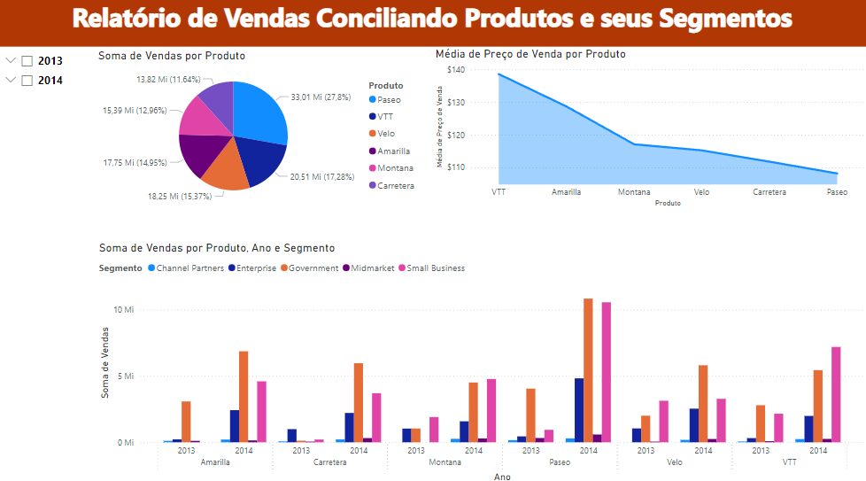
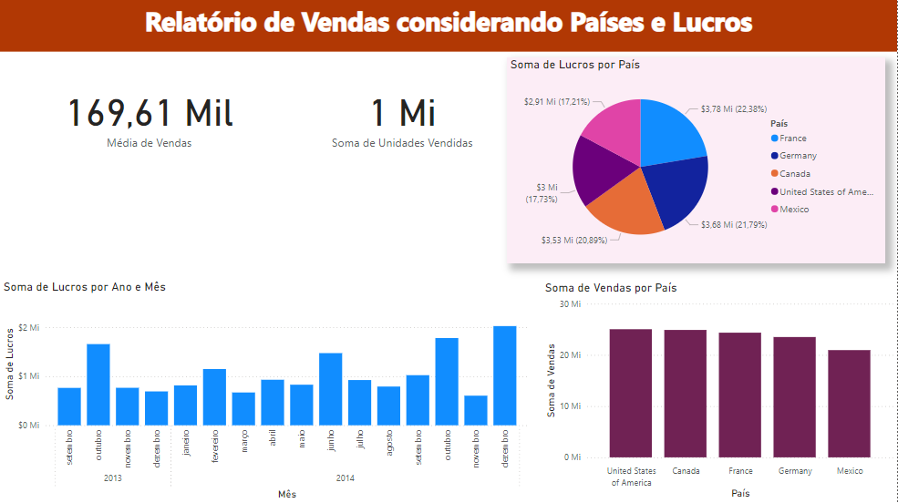

# Sales Report with Power Query

## Project Description

This project aims to create a simple sales report using Power Query for data processing. The generated report consists of three main pages, each focusing on different aspects of sales and profits.

## Report Structure

1. **Page 1: Relatório de Vendas Conciliando Produtos e seus Segmentos**
   - This page provides an overview of sales, segmenting products according to their categories. It is an important tool for understanding how different product segments are performing in the market.



2. **Page 2: Relatório de Vendas considerando Países e Lucros**
   - Here, the analysis focuses on the countries where sales occurred, highlighting the profits generated in each. It is essential for identifying the most profitable markets and where sales strategies are most successful.



3. **Page 3: Distribuição de Lucros, e Unidades Vendidas por País e Segmento**
   - The last page provides a detailed distribution of profits and the number of units sold, cross-referencing the data by country and product segment. This analysis helps understand the combined performance of product segments in different geographic regions.


## Technologies Used

- **Power Query**: Used for data processing and transformation, facilitating the preparation of raw data for report creation.
- **Financials Dataset**: The data source used for creating the report, containing detailed financial information on sales, products, segments, and countries.

## How to Use

1. **Clone the Repository**
   ```sh
   git clone https://github.com/Helton-Rubens/simple-report
   ```

2. **Open the Project File**
   - Use software that supports Power Query, such as Microsoft Excel or Power BI, to open and manipulate the project file.

3. **Connect to the Dataset**
   - Ensure the `Financials` dataset is accessible and correctly linked in the project so the data can be processed and displayed in the report.

4. **Update the Report**
   - Use Power Query to refresh the data if new information is available and generate new versions of the report as needed.

## Contribution

Feel free to contribute to this project. To do so, fork the repository, create a branch for your modifications, and after making the necessary commits, open a Pull Request for your changes to be reviewed and integrated into the main project.


If you have any questions or need more information, contact me at [rubens.helton17@gmail.com](mailto:rubens.helton17@gmail.com).

**Enjoy exploring and analyzing the sales data!**


## Author

- [@Helton Rubens](https://github.com/Helton-Rubens)


## Follow me there:

- [](https://www.linkedin.com/in/helton-rubens-alexandre/)